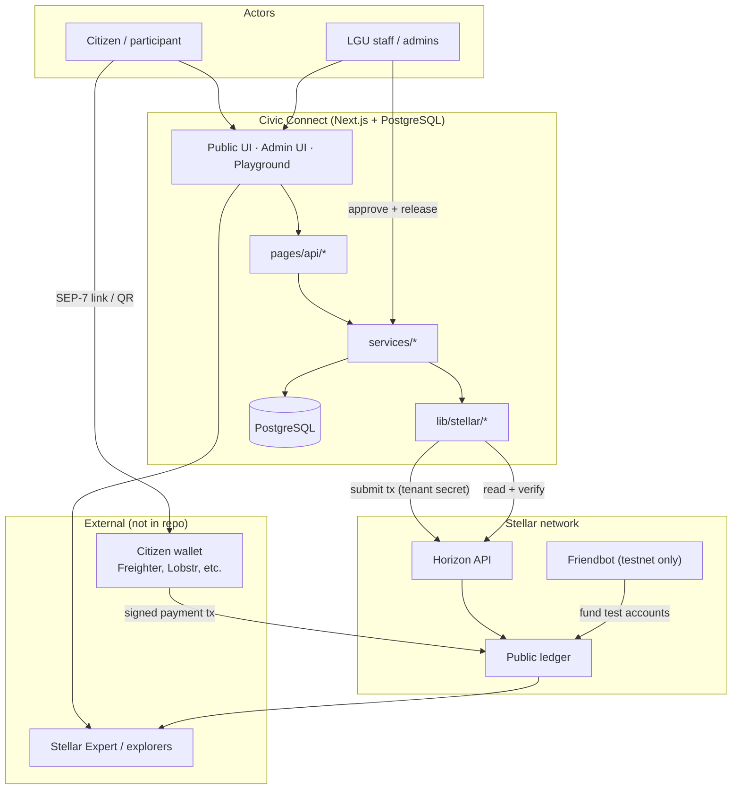
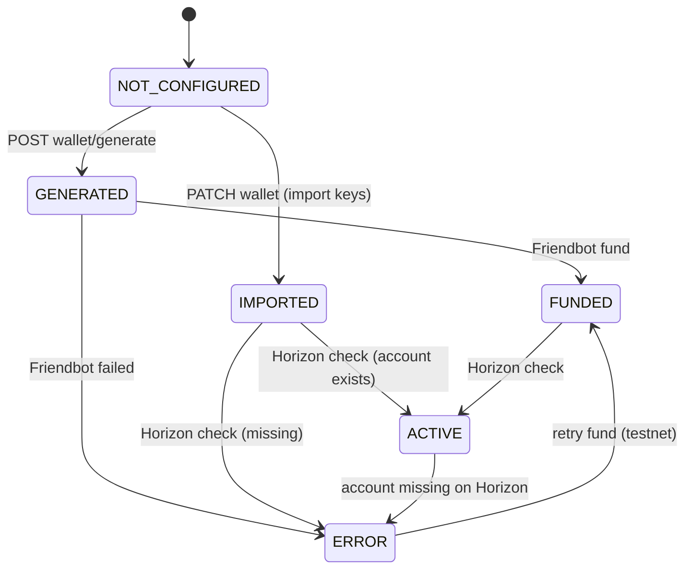
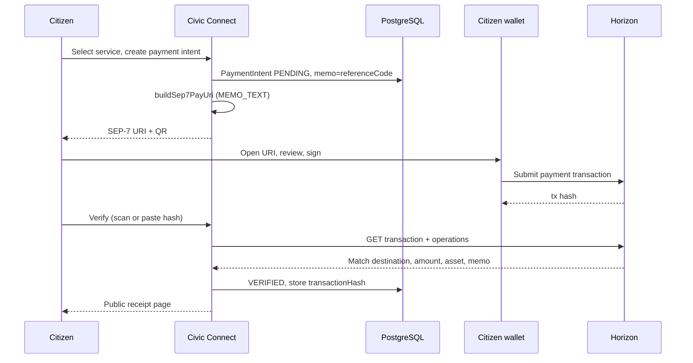
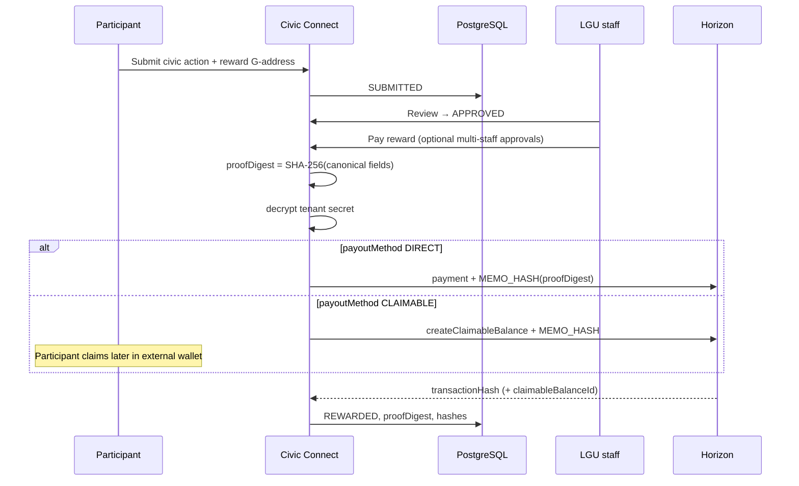

# Stellar Architecture — Civic Connect

This document explains **where Stellar fits**, **what runs on-chain vs off-chain**, and **how the major flows work**. It is validated against the [stellar-300-ideas wishlist](https://github.com/StellarX26/stellarX-workshop/blob/main/stellar-300-ideas.md) and official Stellar references ([SEP-7](https://github.com/stellar/stellar-protocol/blob/master/ecosystem/sep-0007.md), [claimable balances](https://developers.stellar.org/docs/build/guides/transactions/claimable-balances), [Horizon](https://developers.stellar.org/docs/data/apis/horizon)).

---

## 1. Why Stellar powers this product

Civic Connect is a **multitenant civic platform** for LGUs and communities. Stellar is not a bolt-on payment widget — it is the **public trust layer** that makes civic records independently verifiable.

| Civic problem | Stellar primitive | Wishlist idea |
|---------------|-------------------|---------------|
| Government agencies lose payment records; citizens re-pay or wait months | Immutable transaction hash as permanent receipt | **#76 Proof-of-Payment for Government Services** |
| Citizens must pay fees without the app custodying their keys | SEP-7 delegated signing (`web+stellar:pay`) | **#17 SEP-7 Printable Payment QR** |
| Low barangay assembly / cleanup participation | Small outbound rewards from LGU wallet | **#228 Civic Participation Reward**, **#231 Environmental Cleanup Reward** |
| Municipal spending is opaque | Public disbursements anchored on-chain | **#243 Municipal Budget Transparency** |
| Reward recipients may not have a funded wallet yet | Claimable balances (native, no smart contract) | **#201 Claimable Balance Manager** (partial — create/track, no in-app claim) |
| Staff need fraud-resistant audit trails | SHA-256 proof digest anchored as `MEMO_HASH` | Tamper-evident record linking (protocol-native 32-byte memo) |

**Why Stellar over alternatives (for this scope):**

- **Classic operations are sufficient** — payments, claimable balances, and memos cover the current product without Soroban.
- **SEP-7 is the standard** for “app requests payment, wallet signs” — aligns with [SEP-7 security goals](https://github.com/stellar/stellar-protocol/blob/master/ecosystem/sep-0007.md) (no secret exposure, wallet-side signing).
- **Sub-second ledger closes and low fees** suit micropayment-scale civic rewards (1–2 XLM on testnet).
- **Horizon** provides a stable read API for verification without running a Stellar Core node.

**Positioning (from `docs/stellarx-fit-review.md`):** A civic trust platform for verifiable government service payments, public receipts, and transparent civic programs — **not** a generic crypto wallet, DAO, escrow, or NFT product.

---

## 2. Where Stellar sits in the overall architecture

### Layer responsibilities

| Layer | Path | Responsibility |
|-------|------|----------------|
| **Stellar SDK wrapper** | `lib/stellar/` | Network config, keys, encryption, Horizon fetch, SEP-7, verification, tx submit, proof digests, explorer URLs |
| **Tenant wallet** | `services/stellar-wallet-service.ts` | LGU wallet lifecycle (generate, import, fund, check) |
| **Inbound payments** | `services/payment-service.ts` | Payment intents, SEP-7 URIs, Horizon verification |
| **Outbound civic programs** | `services/civic-actions.ts`, `services/transparency.ts`, `services/civic-ledger.ts` | Rewards, disbursements, unified ledger |
| **Release governance** | `services/approval-service.ts` | Off-chain multi-staff approval before outbound chain writes |
| **Learning / demo** | `/about`, `/[tenant]/wallet` | Wallet guidance + testnet practice; live payment flow is the real demo |

### Data model: wallet is on `Tenant`, not a separate table

There is no `StellarWallet` Prisma model. Each tenant stores one **custodial receiving/payout wallet** on the `Tenant` row:

- `stellarReceivingPublicKey` — public G-address
- `stellarReceivingSecretEncrypted` — AES-256-GCM encrypted S-secret (server signing only)
- Per-tenant `stellarHorizonUrl`, `stellarNetworkPassphrase`, `stellarFriendbotUrl`, default asset

Transaction-bearing records: `PaymentIntent`, `CivicAction`, `TransparencyEntry`, `PropertyTaxReceipt`, `CivicTransactionApproval`.

---

## 3. On-chain vs off-chain

### On-chain writes (submitted to Stellar)

| Flow | Operation | Signer | Code |
|------|-----------|--------|------|
| Testnet wallet funding | Friendbot credit | Friendbot service | `lib/stellar/horizon.ts` → `fundTestnetAccount` |
| Citizen service fee | `payment` | **Citizen wallet** (via SEP-7) | External; app verifies only |
| Civic reward (direct) | `payment` + `MEMO_HASH` | **Server** (tenant secret) | `submitSignedStellarPayment` |
| Civic reward (claimable) | `createClaimableBalance` + `MEMO_HASH` | **Server** | `submitClaimableBalanceReward` |
| Transparency disbursement | `payment` + `MEMO_HASH` | **Server** | `publishTransparencyDisbursement` |

### On-chain reads (Horizon, no submit)

| Operation | Purpose |
|-----------|---------|
| `GET /accounts/{id}` | Wallet balance / existence |
| `GET /transactions/{hash}` | Payment verification by hash |
| `GET /accounts/{id}/transactions` | Scan destination for matching memo |
| `GET /transactions/{hash}/operations` | Match payment op (destination, amount, asset) |
| Claimable balance lookup | Resolve `rewardClaimableBalanceId` after create |

### Off-chain only (PostgreSQL)

| Operation | Why off-chain |
|-----------|---------------|
| Payment intent creation | Business record + SEP-7 URI before any payment |
| Civic action submit / review | Workflow state; chain only on payout |
| Transparency draft | Entry exists before disbursement |
| Tax receipt CRUD | No auto-submit; hash entered manually |
| Approval collection | Staff identities and votes are app auth, not Stellar multisig |
| Unified civic ledger view | Aggregates DB records; not live chain reconciliation |
| User / citizen accounts | Standard app auth; no SEP-10 |

### Not implemented

- **Withdrawals** — no flow for citizens or tenants to pull funds back through the app
- **In-app claim** of claimable balances — citizens use external wallets
- **Soroban** smart contracts
- **Chain → DB webhooks / streaming sync** (e.g. Goldsky, Mercury)
- **Stellar multisig** on tenant wallet (approvals are app-level only)

---

## 4. Lifecycles

### 4.1 Tenant LGU wallet (“vault”)

The tenant wallet is the **single custodial vault** for receiving fees and sending rewards/disbursements. It is not a Soroban vault contract.

| Step | API | Service | Chain? |
|------|-----|---------|--------|
| Generate testnet wallet | `POST .../stellar/wallet/generate` | `generateTenantTestnetWallet` | Friendbot funds account |
| Import wallet | `PATCH .../stellar/wallet` | `importTenantStellarWallet` | No |
| Fund (testnet) | `POST .../stellar/wallet/fund` | `fundTenantTestnetWallet` | Friendbot |
| Health check | `POST .../stellar/wallet/check` | `checkTenantStellarWallet` | Horizon read |
| View (safe) | `GET .../stellar/wallet` | `getTenantStellarWallet` | Horizon read for balances |

Secret handling: `encryptStellarSecret` on write; `decryptStellarSecret` only inside payout paths; APIs use `safeTenantSelect` and never return the encrypted secret.

### 4.2 Citizen / participant wallet

**Production:** Non-custodial. The app stores **public keys only** (e.g. `rewardDestinationPublicKey` on `CivicAction`). Citizens sign payments in their own wallet via SEP-7.

**Playground / onboarding:** Practice wallets via client-side `Keypair.random()`, optional local encryption, or Freighter — explicitly not used for production checkout.

There is **no server-side citizen wallet table** and **no withdrawal** flow.

### 4.3 Service payment (inbound)

Memo strategy (inbound): **`MEMO_TEXT`** with the payment `referenceCode` (max 28 bytes enforced in `lib/stellar/transactions.ts` for outbound; SEP-7 sets `memo_type=MEMO_TEXT` in `lib/stellar/sep7.ts`). Verification compares `transaction.memo` to the expected text ([Horizon returns memo on transaction](https://developers.stellar.org/docs/data/apis/horizon/api-reference/resources/transactions/object)).

### 4.4 Civic reward (outbound)

Claimable balances use `Claimant.predicateUnconditional()` per [Stellar claimable balance guide](https://developers.stellar.org/docs/build/guides/transactions/claimable-balances). This lets the LGU commit funds **before** the citizen has a funded account or trustline — the citizen claims when ready.

### 4.5 Transparency disbursement (outbound)

Same pattern as direct reward: staff creates entry → optional approvals → `submitSignedStellarPayment` with `memoHashHex: proofDigest` → status `VERIFIED_ON_STELLAR`.

### 4.6 Tax receipt

**Partial integration:** `proofDigest` is computed at creation, but **no server submit**. Staff manually attach `transactionHash` in admin UI. Appears in unified ledger when hash is present.

### 4.7 Funding summary

| Who | Testnet | Mainnet |
|-----|---------|---------|
| Tenant wallet | Friendbot via API | External funding (no Friendbot) |
| Citizen wallet | Playground Friendbot only | User funds own wallet |
| Rewards / disbursements | Debited from tenant wallet balance | Same |

### 4.8 Withdrawals

**Not implemented.** Neither tenant nor citizen withdrawal flows exist in services or API routes.

---

## 5. Transaction signing, keys, security, synchronization

### Signing model

| Actor | Custodial? | Who signs | Where |
|-------|------------|-----------|-------|
| Tenant LGU | Yes | Server (`TransactionBuilder` + `Keypair.fromSecret`) | `lib/stellar/transactions.ts` |
| Citizen (payments) | No | External wallet via SEP-7 | Outside app |
| Citizen (claimable reward) | No | External wallet claims balance | Outside app |
| Playground user | Browser-local / API demo | User or Freighter | Playground only |

### Key management

- **Tenant secret:** `STELLAR_WALLET_ENCRYPTION_KEY` (AES-256-GCM, format `v1:iv:tag:ciphertext`). Falls back to `ADMIN_JWT_SECRET` if unset — **weaker**; production should use a dedicated 32-byte key.
- **Citizen secrets:** Never stored server-side in production flows.
- **Playground `generate-wallet` API:** Returns plaintext secret — **testnet practice only**.

### Security controls (implemented)

- Duplicate `transactionHash` prevention on `PaymentIntent`
- Horizon-based verification (not trusting client claims alone)
- `MEMO_HASH` proof anchoring for outbound civic records
- Off-chain approval gate before outbound releases (optional per tenant)
- Public APIs exclude encrypted secrets

### Security gaps (vs Stellar best practices)

| Gap | Risk | Recommendation |
|-----|------|----------------|
| App-level approvals ≠ Stellar multisig | Compromised server secret bypasses staff votes | Mainnet: consider multisig on tenant account or HSM/KMS signing |
| No SEP-10 wallet auth | Cannot prove citizen owns G-address at submit | Optional SEP-10 for reward destination binding |
| No rate limiting on verify endpoints | Abuse / Horizon load | Add throttling per reference |
| Encryption key fallback | Weaker key material | Require dedicated `STELLAR_WALLET_ENCRYPTION_KEY` in production |
| Playground returns secrets | Testnet leakage habit | Gate behind env flag or remove duplicate API |

### Synchronization with the network

The app uses **request/response Horizon polling**, not continuous sync:

1. **Inbound payments:** User triggers verify → Horizon lookup → DB update.
2. **Outbound payouts:** Submit → store returned hash/ledger immediately.
3. **Unified ledger:** Reads **PostgreSQL only**; explorer links are derived from stored hashes.

There is **no** reconciliation job that re-scans Horizon to fix DB drift. If a manual chain transaction occurs outside the app, the DB will not reflect it unless staff enters a hash (tax receipts) or a verify flow runs (payments).

---

## 6. SDKs, APIs, and services — inventory

| Dependency | Used? | Necessary? | Notes |
|--------------|-------|------------|-------|
| `@stellar/stellar-sdk` ^16 | Yes | **Yes** | Keypair, `Horizon.Server`, `TransactionBuilder`, `Operation.payment`, `Operation.createClaimableBalance`, `Claimant`, `Asset`, `Memo` |
| Horizon REST (`fetch`) | Yes | **Yes** | Reads in `horizon.ts` / `verification.ts`; could unify on SDK `Server` only |
| Friendbot HTTP | Yes (testnet) | **Testnet only** | [Official testnet faucet](https://developers.stellar.org/docs/tools/developer-tools/friendbot) |
| SEP-7 URI builder | Yes | **Yes** | Matches [SEP-0007 `pay` operation](https://github.com/stellar/stellar-protocol/blob/master/ecosystem/sep-0007.md) |
| `qrcode` npm | Yes | **Yes** | PNG QR for checkout |
| Stellar Expert URLs | Yes | Optional | UX only; any explorer works |
| Freighter (`window.freighterApi`) | Playground only | Optional | Not required for production SEP-7 QR flow |
| Soroban SDK | No | Not for current scope | Wishlist ideas using Soroban are future |
| SEP-10 / SEP-24 | No | Not for current scope | No anchor/fiat ramp |
| `@stellar/freighter-api` | No | Optional | Playground uses raw extension API |
| Mercury / Goldsky / Hubble | No | Optional later | Would enable real-time sync |

---

## 7. Wishlist alignment matrix

| Wishlist # | Title | Status in codebase |
|------------|-------|-------------------|
| 17 | SEP-7 Printable Payment QR | **Implemented** — `buildSep7PayUri`, QR routes, checkout UI |
| 76 | Proof-of-Payment for Government Services | **Core product** — payment intents + verification + receipts |
| 201 | Claimable Balance Manager UI | **Partial** — create + track ID; no in-app claim UI |
| 228 | Civic Participation Reward | **Implemented** — `CivicAction` type PARTICIPATION |
| 231 | Environmental Cleanup Reward | **Implemented** — `CivicAction` type CLEANUP |
| 243 | Municipal Budget Transparency | **Implemented** — `TransparencyEntry` + on-chain disbursement |
| 165 | Digital Property Tax Receipt | **Partial** — proof digest + manual hash only |
| 32 | Stellar Receipt Aggregator | **Partial** — `getCivicLedger` unifies records; not BIR-formatted export |

Deliberately **not** pursued (per wishlist audit — crowded or out of scope): generic escrow, DAO voting, NFT ticketing, lending, crowdfunding, Soroban-heavy flows.

---

## 8. Simplification opportunities

### 8.1 Remove duplicate playground API routes

| Keep | Remove / merge into |
|------|---------------------|
| `pages/api/stellar-playground/wallet/fund.ts` | `fund-wallet.ts` (duplicate Friendbot) |
| `pages/api/stellar-playground/verify-transaction.ts` | `verify-payment.ts` (add explorer URL to one handler) |
| `pages/api/stellar-playground/account/[publicKey].ts` | `account.ts` (support GET and POST in one route) |

**Estimated reduction:** ~3 route files + update `wallet-onboarding.tsx` to use canonical paths.

### 8.2 Collapse re-export shim

- `lib/stellar.ts` only re-exports `lib/stellar/index.ts` — importers can use `@/lib/stellar` via `index.ts` directly; delete shim.

### 8.3 Split `civic-stellar-service.ts` (~927 lines)

| New module | Functions |
|------------|-----------|
| `civic-action-service.ts` | create, list, review, pay reward |
| `transparency-service.ts` | CRUD, publish disbursement |
| `tax-receipt-service.ts` | CRUD |
| `civic-ledger-service.ts` | `getCivicLedger` |
| `civic-proof.ts` | shared `createUniqueReference`, proof digest helpers |

Preserves behavior; improves navigability.

### 8.4 Unify Horizon access

Today: **SDK** `Horizon.Server` for submits, **raw fetch** for reads. Pick one style (SDK for both, or fetch for both) inside `lib/stellar/horizon.ts` to reduce mental overhead.

### 8.5 Unify reference-code generation

`createUniqueReference`, `createUniquePaymentReferenceCode`, and similar loops — single `lib/reference-code.ts` with table-specific prefixes.

### 8.6 Complete or cut half-integrated features

| Feature | Options |
|---------|---------|
| Tax receipts | Add `publishTaxReceiptOnChain()` mirroring transparency **or** document as off-chain-only |
| Claimable rewards | Add read-only “claim status” via Horizon **or** link-only UX with clear copy |
| Unified ledger | Add optional “re-verify on Horizon” button **or** nightly reconciliation job |

### 8.7 Playground vs production

`stellar-playground-client.tsx` (1395 lines) overlaps tenant wallet concepts. Consider extracting shared hooks from `lib/stellar/` and keeping playground as a thin demo shell.

---

## 9. Recommended reading order in the codebase

1. `lib/stellar/config.ts` — network resolution
2. `lib/stellar/sep7.ts` + `services/payment-service.ts` — inbound money path
3. `lib/stellar/transactions.ts` + `lib/stellar/verification.ts` — write vs read
4. `services/stellar-wallet-service.ts` — tenant vault lifecycle
5. `services/civic-stellar-service.ts` — outbound programs + ledger
6. `services/approval-service.ts` — off-chain release gate
7. `components/public/payment-checkout.tsx` — citizen payment UX

---

## 10. One-sentence summary

**Stellar is the verifiable receipt and disbursement layer:** citizens pay LGUs through SEP-7 without surrendering keys; LGUs custody one server-signed wallet for fees, rewards, and transparent outbound payments; PostgreSQL holds workflow state while Horizon + transaction hashes provide independent public proof.
